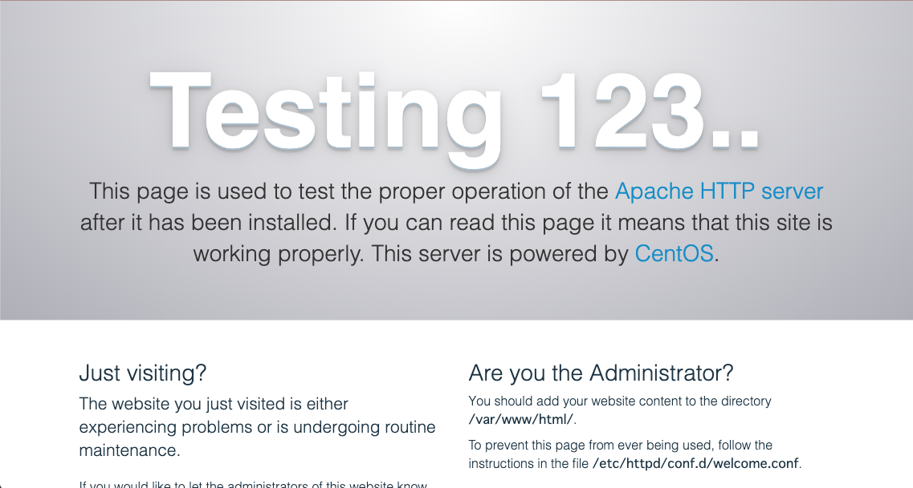
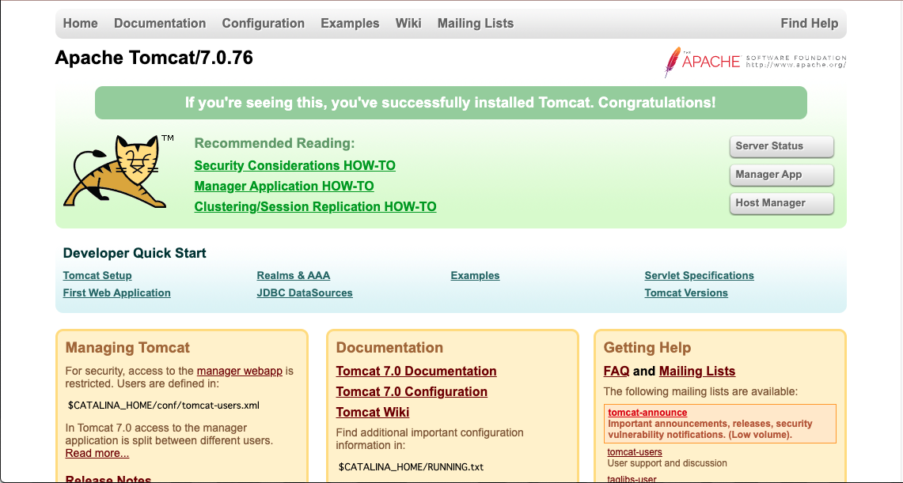
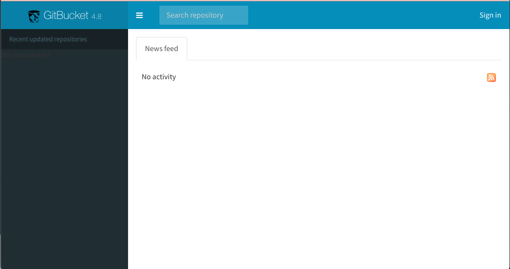
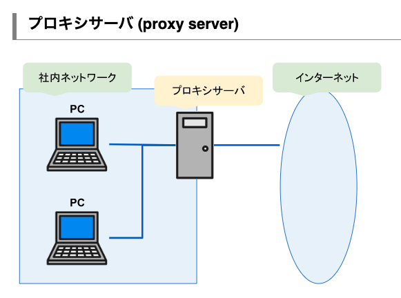
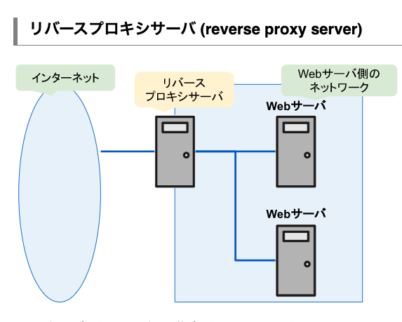
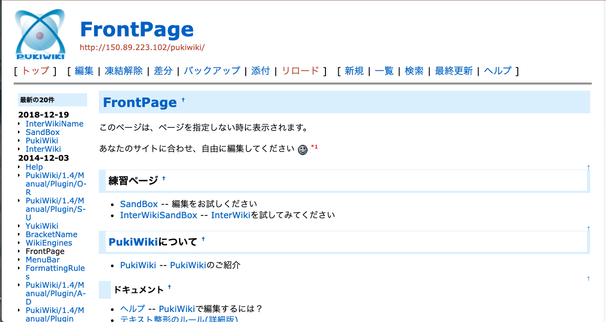

# 評価実験用演習課題

## 演習概要

- ### 2 種類の Web アプリケーションを動作させる課題を行う．演習の流れとしては，まず Web サーバである Apache のセットアップを行い，各アプリケーションを動作させる為の環境の設定，アプリケーションのデプロイ(適切な位置にファイルを配置する)を行うという流れになっている．

- ### 実行するコマンドは Google で検索して良い．ただし，コマンドは手動で打ち込むこと．

- ### 演習時間は 100 分

## 実験の目的

- ### 今回の評価実験の目的として，サーバ管理演習を通して被験者が課題に行き詰まった際に，それを研究で作成したシステムが検知できるのかどうかという部分が重要になる． その為，課題に行き詰まった場合はすぐに教員または，西村に質問をして欲しい．

# Exercise1 　 Apache のセットアップ

## 1. Apache のインストール

### 実験環境である Centos7 は，yum というパッケージ管理ツールを利用してソフトウェアの管理が行える．yum コマンドを用いてソフトをインストールする方法を調べて Apache をインストールしてください． Apache のソフトウェア名は httpd である．

### httpd をインストールする

    (インストールコマンド) httpd

## 2. Apache の操作方法

### CentOS7 では，systemclt コマンドでソフトウェアの操作を行うことができる．インストールが完了したら 以下に示した ソフトウェア を起動するコマンドを実行する．Apache は設定ファイルを編集した場合，再起動を行う必要がある．必要に応じて以下のコマンドを参考にしてほしい．

### ソフトウェアの起動

    systemclt start ソフトウェア名

### ソフトウェアの停止

    systemctl stop ソフトウェア名

### ソフトウェアの再起動

    systemctl restart ソフトウェア名

### ソフトウェアの状態確認

    systemctl status ソフトウェア名

### ここままの設定であれば,PC をシャットダウンすると OS の全てのプロセスが終了してしまうため，PC を起動するたびに起動のコマンドを実行する必要がある.そこを省略する為に,以下のコマンドが用意されている.このコマンドを実行することで PC を起動した時に Apache も自動的に起動する設定できる．

### 自動起動設定

    systemctl enable ソフトウェア名

### 自動起動解除

    systemctl disable ソフトウェア名

## 3. ファイアウォールの解除

### CentOS7 のファイアウォールのソフトウェア名は firewalld である．

    (停止コマンド) ソフトウェア名

## 3. 動作確認方法

### ブラウザで以下の URL にアクセスし，以下のような画面が表示されていれば接続が成功

    http://ip_address/

# Exercise2 　 Gitbucket

## 1. Java のインストール

### Gitbucket は Java Servlet という仕組みで動作している．従って，この環境で Java が動作する必要がある．yum を用いて以下の Java をインストールする．

    (インストールコマンド) java-1.8.0-openjdk-devel.x86_64

## 2. Tomcat のセットアップ

### Gitbucket を動作させるためには，Tomcat と呼ばれる Java Servlet を実行するソフトウェアが必要になる．そこで yum を用いて， Tomcat と Tomcat-webapps をインストールする．

### Tomcat と Tomcat-webapps のインストール

    (インストールコマンド) tomcat tomcat-webapps

### インストールが完了したら，Apache と同様に起動コマンドを実行する．

### Tomcat の起動

    (起動コマンド) tomcat

### Tomcat の自動起動設定方法

    (自動設定コマンド) tomcat

### ブラウザで以下の URL にアクセスし，以下のような画面が表示されていれば接続が成功

    curl ip_address:8080

## 2. gitbucket のファイルをダウンロードする

### gitbucket のファイルをダウンロードする前にファイルを配置するためのディレクトリに移動してもらう. 配置先のディレクトリは、/var/lib/tomcat/webapps/である.

### インターネットからソフトをダウンロードする際に利用できるコマンドとして代表的なものに wget がある. 以下に基本的な使い方を示す.

    wget（ダウンロードしたいファイルのURL)

### 今回構築したい gitbucket のファイルは以下の URL にある

https://github.com/gitbucket/gitbucket/releases/download/4.8/gitbucket.war

### ブラウザで以下の URL にアクセスし，以下のような画面が表示されていれば接続が成功

    http://ip_address:8080/gitbucket/

## 3. リバースプロキシの設定を行う(Apache と Tomcat の連携設定)

### プロキシとは

### インターネット接続を行う際に，直接自分のサーバをインターネットにアクセスさせるのではなく，代理サーバにアクセスさせることでセキュリティ面や，コンテンツのキャッシュなどが可能になる

### リバースプロキシとは

### リバースプロキシはWebサーバ側に設置するプロキシサーバのことであり，ロードバランサ(負荷分散機能)や画像ファイル等のキャッシュなどが可能になる．

###  詳しくは以下のリンクを参照
https://itsakura.com/network-proxy

### Apache のサーバにアクセスがあった場合，Tomcat のページに接続できるように Apache の設定を行う．Apache の設定ファイルは/etc/httpd/conf/httpd.conf に追記するか，/etc/httpd/conf.d/以下に proxy.conf ファイルを作成し，以下のキーワードを記述する．パラメータの部分については Google 等で調べて欲しい．

    <Location /gitbucket/>
        ProxyPass (パラメータ)
    </Location>
    

### 設定が完了したら Apache を再起動

    (再起動のコマンド) httpd

### ブラウザで以下の URL にアクセスし，以下のような画面が表示されていれば接続が成功

    http://ip_address/gitbucket/

# Exercise3 　 pukiwiki

## 1. PHP のセットアップ

### pukiwiki は PHP で動作している．従って，この環境で PHP が動作する必要がある．以下のソフトウェアを yum を用いてインストールしてください．

    (インストールコマンド) php php-mbstring

## 2. PHP の設定ファイルをコピーしておく

### サーバ管理において設定の変更は多く発生する．

    cd /etc
    (ファイルコピーコマンド) php.ini php.ini.org

## 3. PHP の設定ファイルを編集する

    vi php.ini
    date.timezone = Asia/Tokyo

## 4. PHP の設定を読み込ませるために，Apache の再起動を行う．

    (再起動のコマンド) httpd

## 5. pukiwiki のファイルをダウンロードする

    cd /var/www/html
    wget (ダウンロードしたいファイルのURL)

### 今回構築したい pukiwiki のファイルは以下の URL にある

https://ja.osdn.net/frs/redir.php?m=iij&f=pukiwiki%2F69652%2Fpukiwiki-1.5.2_utf8.zip

## 6. zip ファイルを解凍して，zip ファイルの削除を行う．コマンドは各自調べる．ソフトがなければ探してインストールする．

    (zipファイル解凍コマンド) pukiwiki-1.5.2_utf8.zip
    (ファイル名変更コマンド) pukiwiki-1.5.2_utf8 pukiwiki
    (ファイル削除コマンド) pukiwiki.zip

## 7. ディレクトリの所有者を apache に変更する．所有者変更コマンドは各自調べる．

    (所有者変更コマンド) pukiwiki

## ブラウザで以下の URL にアクセスし，以下のような画面が表示されていれば接続が成功

    http://ip_address/pikiwiki/

